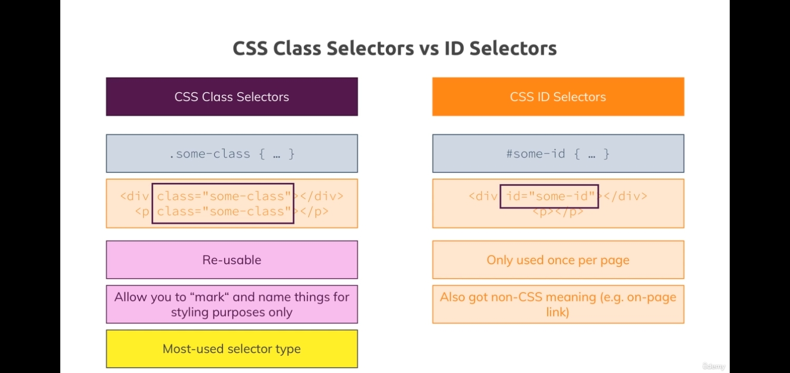

# Theory

# Combinator

[Combinator](https://github.com/PacktPublishing/CSS---The-Complete-Guide-incl.-Flexbox-Grid-and-Sass-/blob/master/Section%202/css-combinators.pdf)

# Selectors

- It refers to what is selected to make style changes.
- Like class , element or universal (\*) is selected.

# Priority

[priority](https://github.com/PacktPublishing/CSS---The-Complete-Guide-incl.-Flexbox-Grid-and-Sass-/blob/master/Section%202/css-specificity.pdf)

- More specified tag are given more priority. EG:-
  `.product < product.h1`

- In above eg, the h1 will be modified by more specified one, tho .product is not wrong to make changes in h1.

1. Inline styles. like `<style> = ()`
2. #ID selectors.
3. .class, :pseudo-class (EG:- hover) and attribute selectors .
4. elements (like a, div , p) and :pseudo-element selector (EG:- \* )

We must use `body` instead of `*` if you want to put style to every elements and overwrite any style.

`body` style will be inherited to every element.

# Div & nav on same line (Chp 3: L13-L16)

Its tough to understand the concept and using it rather than randomly trying things in css.

## display : \* _inline-block_ :-

- Outer header/div:- Used to print on same line/same row. But yet it wasnt visible on same line.
- li tags :- Used to align the lists into horizontal positions rather than viewing them on different lines.

## List style: none

Must be used in that class only to remove the bullets from ul.

## Width calc

> IMPORTANT CONCEPT

```CSS
width: calc(30% - 8px)
```

> The space infront and ahead - is important.

- We reduced nav by 57px even tho the div was of 48 px.
- Its not possible to minus 48px and view them on same line because the space inside the html file between <div> and <nav> tag is also calculated (literally space inside of an html file). If the div and nav tag is placed on the same line and then 48px in decreased then we can see the proper results.

* IF we change the font-size of div, we should deduct those px from the width.

## Vertical align:middle

Used to align the text vertically middle of that box and both the text will be on same height in that box.

Its a minor change which we must keep in mind.

## a (anchor) tag styling

- Class doesnt work , ID works.
- Browser by default directly point the `a` tag so we have to put styling very specifically on it.

## background image

`background-image:url(name of img or the url)`

# pseudo class (:)

- hover, active, playing, pause, not.

## not pseudo class

- This class is used to select all the elements except the specified class.
  ```CSS
  a:not(.pro){}
  ```
- Here, pro class ka a tag will not be affected.

## focus

- Used to make changes when we click the specified tag like button or any div box.
- Can change text color , bg color , etc.

# pseudo elements (::)

- first line, after, before, first letter

## Id vs class



- Using ID, you can make your anchor clicks work to reach different locations on your web page.

# Plan Part in the file

- `article` tag is used to keep the content separate from others.

* Display inline-block is used to add all the 3 boxes in the same line with the help of width tag.

- Middle box is bigger as it has an extra heading.

# 1. **Inline** :-

Displays an element in the same line. (like `<span>`). And take only the space which a word needs.

- **Any height and width properties will have no effect**.

# 2. **Block**:-

- Displays an element which starts on a new line, and takes up the whole width. It adjusts the box into the column by default.
- Can change the width and height of block and elements appear on different line.

# 3. **Inline-block**

- Take only the required space & same line like inline element and widht height can be adjusted like block .

# Path Managing

- To display any image or anything in md or html through downloaded files but different directory, we must right its correct path.

- EG:-

```CSS
FOR CSS:-
    background-image: url(/Notes_resources/peace.png);
```

# 5.

## Float & clear

- It changes the position of any element and the place will be occupied by other element.
- Very useful to float image and text in the same line.
- _clear_ is used to prevent any element to take the place beside the floating element and both will be visible on separate lines.
- Important hack for clear :- Use **div** to clear the floating boxes or elements , like add an empty div between them and then style it.

  **_ID > Class_**

## Div as container

- Whenever we want to adjust the whole column which contains like 3,4 boxes with content , we can put them into div and can add styling to div.
- This will affect the column and not the box or the content of box.

# 6.

## z-index

- We can use z-index with position when an element is getting overlapped by other while scrolling , simply set the z-index according to priority to adjust both the elements.
- Using "position" is important & necessary with z-index otherwise it wont work.
- We use `-` sign to add any boxes in the end.
- Used to overlap the elements/ boxes.
- Greater the number of index, more will be the priority, means it'll be at the top.
- Default value is 0 in browser

## positions in css

Default value is static in the browser.

### 1. **Fixed**:-

- This position of it will remain at the same place on the screen even if we scroll the pg.
- Best to use for nav bars for a browser.
- If we change the margin of html , then we have to use `left: 0 and right:0` to fix for eg a nav bar .

### 2. **Absolute**:-

- This will overlap the boxes and the text if we put the styling accordingly.
- It will refer to the html position by default but will refer to the ancestor element which have the position style in use.
- This reference will be for the positions we apply through left, right styles.
- It is not stuck on the web page like fixed.

### 3. **Relative**:-

- NOTE :- In **relative** , the distance changed will be with reference to the element itself because the positioning context is the element. While in **absolute** and **fixed** the reference is with the html file.
- top, right, bottom, and left properties of a relatively-positioned element will cause it to be adjusted away from its normal position.

### 4. **Sticky** (rarely used)

- A sticky element toggles between relative and fixed.
- It wont have any effect unless top , bottom , left , right is used with it, it'll just act as it doesnt exist.
- It stops once its parent element is closed.

## Stacking Context

- child element's z-index has no effect on other parent elements .
- It says that if there are 2 parent elements , one has z-index 1 and another one has 100 . If child element of parent element which has z-index 1 has z-index of 1000 then still the child will lie below the 2nd parent element.

# 11 .

## 1 grid-column property

- Number of child elements is equal to the number of columns.

## text-transform

- Used to transfer the text into uppercase, lowercase ,etc,

## Overflow ( scroll/auto/hidden/visible;)

- Scroll is very useful for any part of ur website to be scrolled in a certain list.

## background image VS color

- Img overwrites color even if color is used down .

## background-size

- Used to fit the img properly in the web .
- **cover** is used to fit the image properly into the container.
- **contain** is used to fit the image without cropping it. In cover , its kind of cropped .
- We can manually add the size too of the image.

## background-position

- We can use this only with the background image.
- We can add the position of image that how far the space must be.
- With `%` it'll adjust the image of the cropped part , ie , if we want some bottom part of img to be in the frame then we can adjust it y-axis and keep x as 0 .
- `%` wont work if the image is already fixed properly. For adjust that, use px or any other unit.
- We can also use `left` or `left 10%` to set left as `0%` or `10%`.

[bg-properties](https://github.com/PacktPublishing/CSS---The-Complete-Guide-incl.-Flexbox-Grid-and-Sass-/blob/master/Section%207/css-background-properties.pdf)

## background-origin

- border-box (content will also include border ie below border there wont be white space) , padding-box (includes padding and content but not the border , ull see difference if u set the border as dashed), content-box (removes the padding , margin).

## background-clip

- Overwrites origin but kinda similar to origin.

## background-position

- Used to adjust image the way we want.

## backgroud shorthand property

- background position and size are separated by a slash , if only one value is specified like border-box then it'll be added to both origin and clip otherwise if we mention both then origin will be accepted before clip.

## editing img (not bg img)

- Background img is added in css , this img is added in html by specifing the path.
- We have to select the img tag separately to edit it , because it doesnt inherit the size of container.
- It has its own size and the only way to edit is this.

## aligning img and text

- To align the text and image side by side, best way to do is to set the _image container_ and the _text_ element style as `inline-block` and `vertical-align:middle` to properly see them side by side.

## border glitch

- If we have an image in an image container in the form of inline property , then shadow will give some extra white space , so to remvoe that we can use `vertical-align` or `display: block` .

## linear gradient

- Both linear and radial gradient counts as image .
- linear gradient(direction , color) , Here direction is by default from top to bottom . We can adjust the direction according to our desire.
- We can add degrees to the direction like `30deg` .

## radial gradient

- It basically gives shape the bacskground acc to the color . Default shape is ellipse.
- We can give the shapes and direction at the same time and also the width `circle to top` or `circle width` .
- The width applicstion changes according to the shape , like circle takes 1 arguemnt while ellipse will take 2 . We can assign the width to the colors too .

## filter

- We can add many visual things by using filter
- EG:- `grayscale` can add grey color .

## SVG

- It doesnt get blurly however times we zoom it. Its size is also smaller than jpg , etc.
- It gives more control than img to change the img , like we can change the lines of flowchart, eyes of any face , width of image , etc

## Units

- rem is like it will multiply the value with the root value ie with the html's value which could be set or like the default.
- For **padding** , **font-size** and **margin** (margin not always) use **rem** because it makes the things look good in different device with different defaults.
- em must not be used because it multiplies the value with the parent's/ ancestor's value . If you use it in twice nesting then it'll multiply the value twice which could be fatal and confusing.

# Media query

- So in this we must align the tags according to the size in ascending order otherwise it wont work.
- Try to include this style at the end of your website.
- Make your website for phone and then through this styling make it for desktop.
- We have to use min/max-width after the @media query and also in the containers to stop their size after a certain limit.

# invalid && valid pseudo selector

- Used to highlight the invalid statements.
- Can be used with required attribute in the input tag.

# Font styles

## @font-face

- We can add the font file from the files into this using src

#

## @import url()

- Font from google could be added by this.

## letter spacing

- It increases the space between each of the letters.

## white space

- We can use **pre** to add space of a paragraph.
- We can use **nowrap** to print all the text on the same line.

# flexbox

- children tags acts as flex items and we can use align-self for it.
- Parents tags mai we can use **justify-content** , **align-content** , **align-self** , etc properties.

## inline-flex

- inline-flex are also used to align the items in the same line but while decreasing the size the item's size **wouldn't decrease**.

## flex-wrap & flex-direction

- As soon as we change the size in flex-wrap , the items move to the **next line**.
- In flex-direction , if size of items are **defined** then it **wont change** but if its **not defined** then it will be **adjusted according to the page** size.

## main and cross axis

- In flex-direction column ,
  - main axis will act as column.
  - cross axis will act as row.
- In flex-direction row ,
  - main acts as row and cross acts as column.

## flex-items & justify-content

- **flex-items** follows the **cross axis** and **justify content** follows the **main axis**.
- If the direction is column , then the flex-items will act as column and justify-content will act as row.
- If the direction is row , then the flex-items will act as column and justify-content will act as row.

## Trick to center the items

- It could be done by _justify content_ **center** if the _flex-direction_ is **row** and could be done by _flex-items_ **center** if the _flex-direction_ is **column**.

## align-content

- Combination of align-items and justify-content , if we decrease the size of item then it will **wrap** the item according to the property which we assign to the align-content.
- The value will be **triggered** as soon as we **decrease** the size of the items or if the size of **container** is **smaller** than the items to fit in.

## order

- We can **adjust** the order of child elements by using **order**

## align-self

- It can only be used on one element at a time , you cannot use it for more than one child elements.
- It follows the **cross axis** ie opposite the direction of the flex.

## flex-grow

- It can only be used on one element at a time , you cannot use it for more than one child elements.
- It keeps growing from its given width if we change the width of the screen.
- Default value is 0.

## flex-shrink

- Default value is 1.
- It can only be used on one element at a time , you cannot use it for more than one child elements.
- It keeps reducing from its given width if we change the width of the screen.

## flex-basis

- Always follows the main axis only.
- It gives the height or width value wrt to the direction.
- If direction is **row** , then the value inside the flex-basis will **overwrite** the **width** and if direction is **column** then will overwrite **height**.

# Grid

- Very important to give the positions to the elements and its handles the hardest part of web page ie to give the positions.

## display grid

- It gives the rows and columns according to the elments present inside the parent element like each child acts as row and if child have grandchilds then child will be one column and grandchild row inside that column.

## grid-template-columns/rows

- We can add the columns no matter the child elements by giving the size in px , % or fr.
- It will create column which doesn't exist.

## grid-(column/row)-(start/end)

- This is used to adjust the space to be taken by the element like to join multiple rows and columns.
- By passing the **value** as the number of the line of column/row which we can see from layout , this indicates that **till** how much block it must **exceed**.
- **auto** fills up the remaining space of the row or column by the last element and this could be very helpful .
- **repeat** is used to avoid the repetation of values we want to give , for eg , if we want to create 16 rows then writing **(16 , 25%)** is the best way to get .
- Using **span** allows us to mention the number of blocks we need to be merged.

## grid-row/column

- It is a shorthand property to define the start and end of the following.

## grid-gap

- It is a shorthand property to define row-gap and column-gap.
- Also both of the properties can also be defined separately too .
- If we define only one , then it will be applied to both row and column.

## grid-auto-rows/columns

- It allows us to set the size of all the following to the mentioned size inside the property.

## grid-auto-flow

- It allows us to change the flow of the new added elements , the default flow is row for the direct child elements but we can change it to column.
  
  ## auto-fill
  - Used to align the items on the same line automatically, otherwise the size doesn't change. 
  -  This could be used with _grid-template-column/rows_ , as we don't need to specify the number of rows/columns like repeat (2,...). 
  - It utilizes the whole row
  
  ## auto-fit
 - Used to fit all the items on the same line . 
  - Same as **auto-fill** , just the items will be arranged properly if there are less items, for eg, if there are 3 divs it will arrange it in the center of the row. 
  - If the size is decreased the divs will be moved downwards. 
  
 # Grid Vs Flex
  - Use flex when u only want to make changes for rows or columns separately. 
  - Use grid when u want to make changes with both rows and columns. 
  
# Transform
  - It is different from animation :). 
  
  ## Transform-origin
  - Default value is center, 
  - It shows the place from where must the transformation should take place.
  
  ## translateX and translateY
  - It works as left and right of position, it changes the position of the transform. 
  - It is good to use this rather than setting position and giving left right top bottom in transform. 
  - The X and Y will be applied wrt to the box, like it will be parallel to the box. If the box is at 45° , then same will be its path of translate. 
  
  ## translateZ
  - This creates a 3D effect, like Z axis is the axis which is going inside the phone Or coming out to us. 
  - To make it move inside, we use negative value. 
  
  ## skewX and skewY
  - It changes the shape of the box, as if someone pulled it from left or top corners. 
  - The negative values will move it to right and bottom respectively.
  
  ## scaleX and scaleY
  - It allows us to increase the width and height of the image using it inside transform. 
  - Shorthand property is **scale** , which will be applied to both axes. 

  ## perspective and perspective-origin
  - With this we can see the object from different sides which will act as 3D effect. 
  - origin can make us see it from which ever side we want.
  
  ## rotateX and rotateY
  - Used as predefined value inside transform property. 
 - If we rotate the parent element then it'll also rotate all the child elements. 
  - It is used to rotate the boxes . 
 
  ## transform-style
  - Default value is **flat** which means that the container will make the divs move with it along the axis. 

  ## backface-visibility
  - If we want to hide the back side of any div we can use this property with hidden. 
  - Back face means the back side which we are able to see when it's flipped. 
